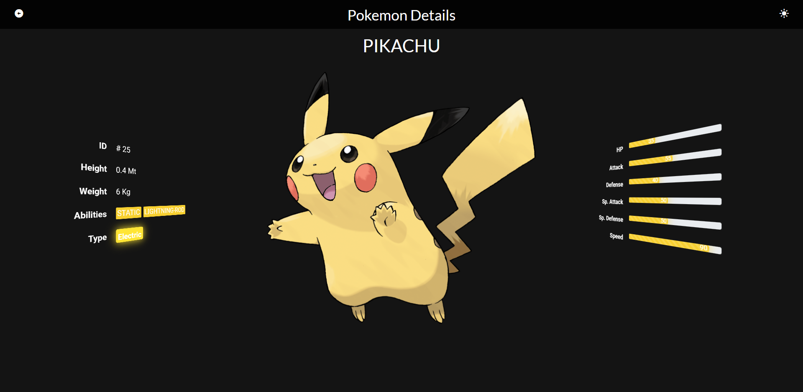
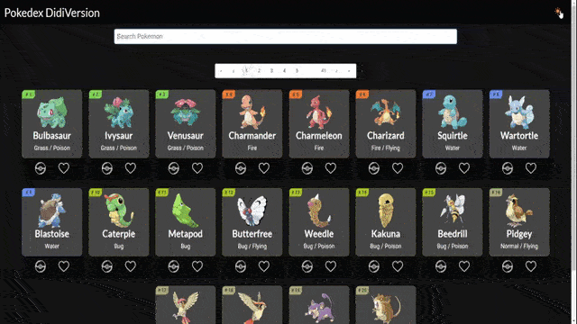

<div align="center">
  
</div>

<h1 align="center">
🚧 Pokedex  | Em Construção 🚧
</h1>

<p align="center">


<a href="https://www.linkedin.com/in/alquiponeto/">
    
</a>

<a href="https://www.linkedin.com/in/luis-carlos-zancanela/">
    
</a>

<a href="https://github.com/didifive/pokedex-old/commits/master">
    
</a>


</p>

<p align="center">

<a href="https://app.netlify.com/sites/pokedex-didi/deploys">
    
</a>

</p>

<p align="center">

<a href="https://reactjs.org/">
  
</a>

</p>

<h2 align="center">
  Bem Vindo à Pokedex DidiVersion
</h2>

<div align="center"> 
  
</div>

## 🚀 Sobre o Projeto

Este é um *Fork* do projeto de **[Alquipo/pokedex-old](https://github.com/Alquipo/pokedex-old)**, com adição da **Context API** do React apresentado pelo **[Júlio Gonçalves](https://github.com/thejullius)** na aula **Trabalhando com context API no react** do **Bootcamp [Impulso React Web Developer][Impulso React Web Developer]** da **[dio.][dio.]**. Nele foram realizadas as modificações:
* Adicionado temas *dark* e *light* com propriedades para cores de fundo e texto correpondentes aos temas;
* Adição do *switch* de troca de tema no cabeçalho (canto superior direito);
* Ajuste do componente `NavBar` para reconhecer, permitir mudar o tema e também mudar suas cores com tema;
* Remoção do componente `NavBarDetail` visto que o `NavBar` foi atualizado para reconhecer a página (pokedex ou pokemon) e modificar conforme necessário;
* Duas maneiras de carregar as cores do tema vigente para aplicar ao respectivo componente:
  * `ThemeContext.Consumer` no componente `Pokemon`;
  * Hook `useContext` no componente `PokemonCard`;

<br/>

```
TODO:
* Adicionar localStorage para guardar as informações de: Tema, Pokemon Pego, Pokemon Favoritado;
* Aprimorar a query;
* Voltar paginação e permitir usuário controlar quantidade de pokemons por página na pokedex.
```

## 🔨 Tecnologias:

- [ReactJs][reactjs]
- [Context API][Context API]
- [Axios][axios]
- [pokeAPI][pokeAPI]

## 🚀 Como rodar este projeto

Para clonar e executar este aplicativo, você precisará de [Git](https://git-scm.com) e [NodeJs][nodejs] Instalado em seu computador.

### 🌀 Clonando o repositório do Alquipo

```bash
# Clone este repositório
$ git clone https://github.com/Alquipo/React-PokeDex

# Acesse a pasta do projeto no terminal/cmd
$ cd React-PokeDex
```

### 🧭 Rodando a aplicação web localmente

```bash
# Instale as dependências
$ yarn

# Execute a Aplicação
$ yarn start

# O servidor iniciara na porta:3000 - acesse http://localhost:3000
```

## 🤔 Como contribuir para o projeto do Alquipo

- Faça um *Fork* do projeto [Alquipo/pokedex-old](https://github.com/Alquipo/pokedex-old);
- Crie uma nova branch com as suas alterações: `git checkout -b my-feature`
- Salve as alterações e crie uma mensagem de commit contando o que você fez:`git commit -m "feature: My new feature"`
- Envie as suas alterações: `git push origin my-feature`

> Caso tenha alguma dúvida confira este [guia de como contribuir no GitHub](https://github.com/firstcontributions/first-contributions)

## 📝 Licença

Este projeto está sob a licença MIT. Veja a [LICENÇA][license] para saber mais.

Atualizado com ❤️ por Luis Carlos Zancanela 👋🏽 [Entre em contato!](https://www.linkedin.com/in/luis-carlos-zancanela/)

[nodejs]: https://nodejs.org/
[express]: https://expressjs.com/
[uuidv4]: https://www.npmjs.com/package/uuidv4
[nodemon]: https://www.npmjs.com/package/nodemon
[rs]: https://rocketseat.com.br
[license]: https://opensource.org/licenses/MIT
[postgres]: https://www.postgresql.org/
[multer]: https://www.npmjs.com/package/multer
[reactjs]: https://reactjs.org/
[Context API]: https://pt-br.reactjs.org/docs/context.html
[axios]: https://www.npmjs.com/package/axios
[babel]: https://babeljs.io/
[webpack]: https://webpack.js.org/
[rs]: https://rocketseat.com.br
[license]: https://opensource.org/licenses/MIT
[typescript]: https://www.typescriptlang.org/
[Impulso React Web Developer]: https://web.dio.me/track/impulso-react-web-developer
[dio.]: https://dio.me/
[pokeAPI]: https://pokeapi.co/